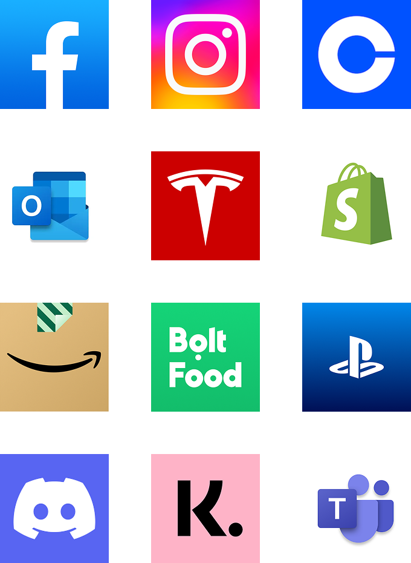
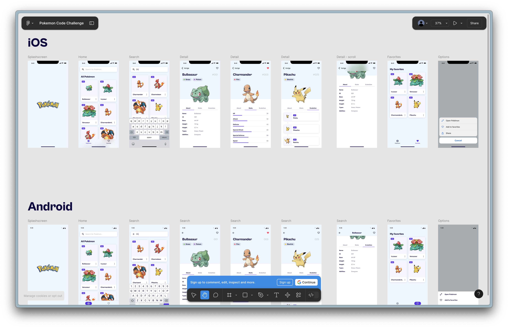
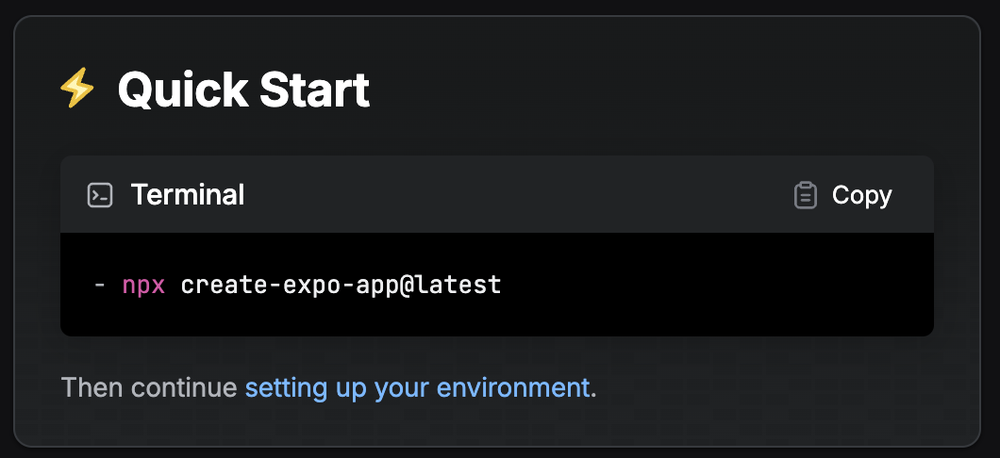
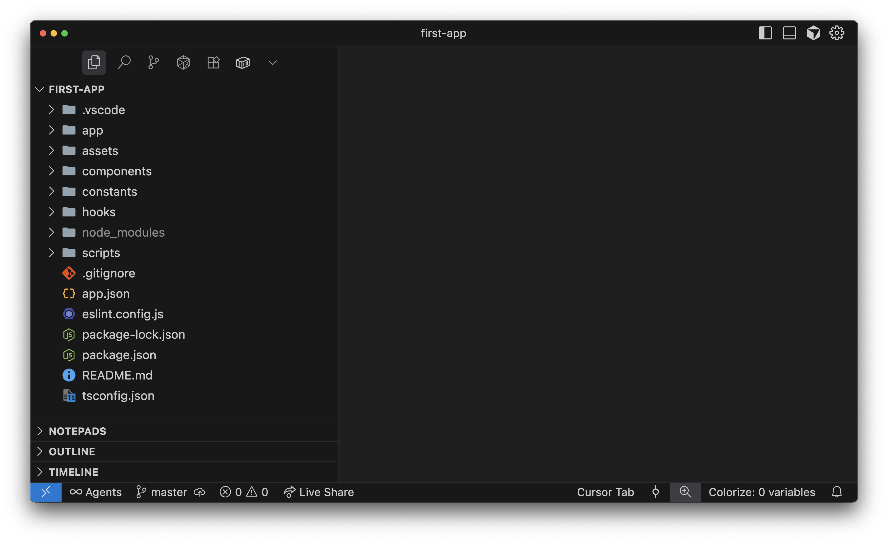
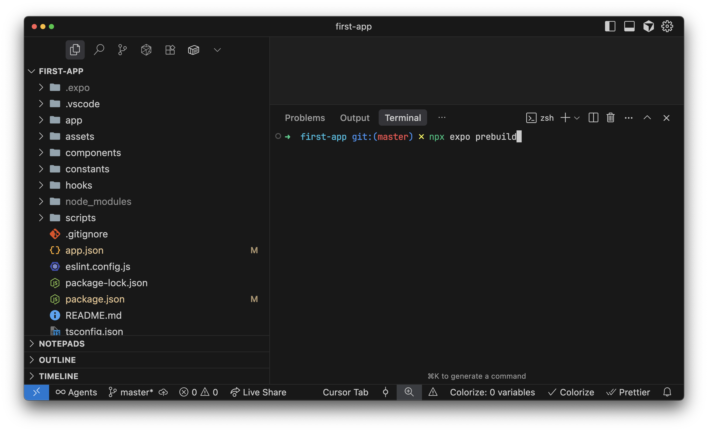
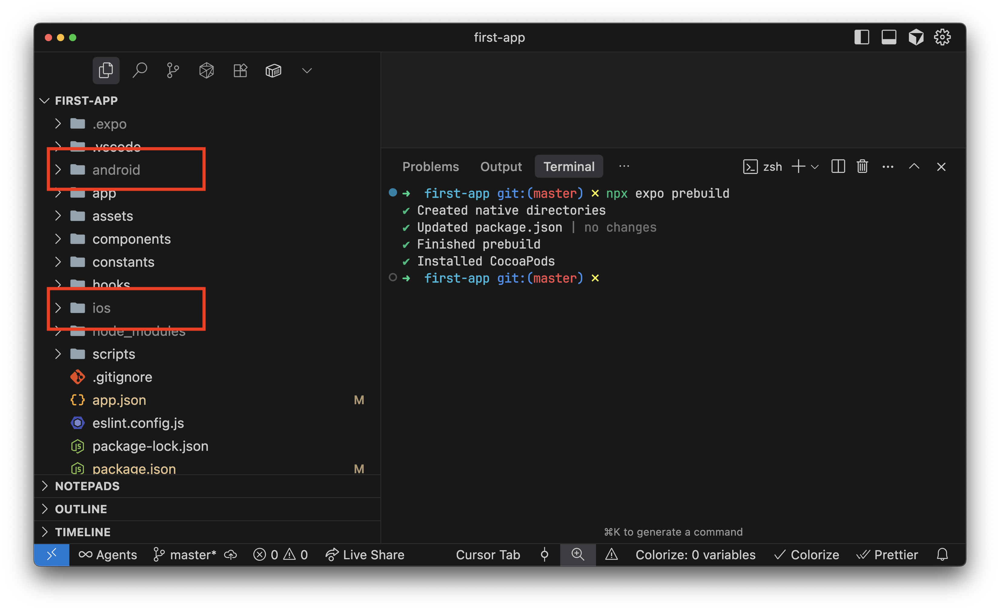
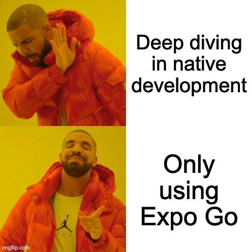
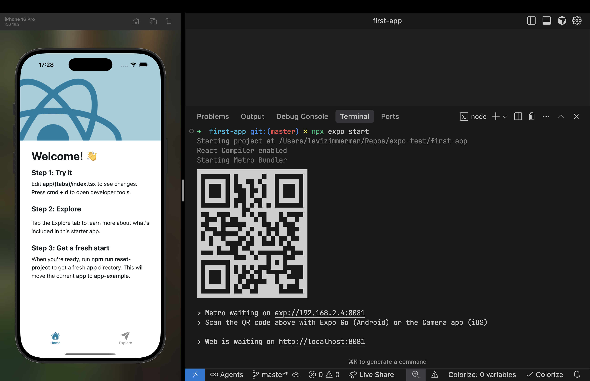

# React Native Introduction
## Mobile Development Minor

---

# About Me 🏸 🍳 🛹 🎵

- 10+ years of web development
- 3+ years of mobile development
- Communication & Multimedia Design
- Working at Triple, Alkmaar

---

# Meet the React Native Team

<table style="width:100%; table-layout:fixed; border:none;">
  <tr style="border:none;">
    <td style="border:none; text-align:center;">
      

    </td>
    <td style="border:none; text-align:center;">
      

    </td>
    <td style="border:none; text-align:center;">
      

    </td>
    <td style="border:none; text-align:center;">
      

    </td>
    <td style="border:none; text-align:center;">
      

    </td>
    <td style="border:none; text-align:center;">
      

    </td>
    <td style="border:none; text-align:center;">
      

    </td>
  </tr>
  <tr style="border:none;">
    <td style="border:none; text-align:center;">Levi</td>
    <td style="border:none; text-align:center;">Max</td>
    <td style="border:none; text-align:center;">Thomas</td>
    <td style="border:none; text-align:center;">Silvan</td>
    <td style="border:none; text-align:center;">Danique</td>
    <td style="border:none; text-align:center;">Leon</td>
    <td style="border:none; text-align:center;">Damisa</td>
  </tr>
  <tr style="border:none;">
    <td style="border:none; text-align:center; font-size:1rem; color:#888;">Team lead</td>
    <td style="border:none; text-align:center; font-size:1rem; color:#888;">Web/RN Dev</td>
    <td style="border:none; text-align:center; font-size:1rem; color:#888;">Web/RN Dev</td>
    <td style="border:none; text-align:center; font-size:1rem; color:#888;">Web/RN Dev</td>
    <td style="border:none; text-align:center; font-size:1rem; color:#888;">Web/RN Dev</td>
    <td style="border:none; text-align:center; font-size:1rem; color:#888;">Tech lead</td>
    <td style="border:none; text-align:center; font-size:1rem; color:#888;">Intern</td>
  </tr>
</table>

---

# Our React Native Projects

<table style="width:100%; table-layout:fixed; border:none;">
  <tr style="border:none;">
    <td style="width:20%; border:none;"><video src="./assets/demo-fleurametz.mp4" autoplay loop muted controls></video></td>
    <td style="width:20%; border:none;"><video src="./assets/demo-knvb.mp4" autoplay loop muted controls></video></td>
    <td style="width:20%; border:none;"><video src="./assets/demo-mind-oasis.mp4" autoplay loop muted controls></video></td>
    <td style="width:20%; border:none;"><video src="./assets/demo-new-black.mp4" autoplay loop muted controls></video></td>
    <td style="width:20%; border:none;"><video src="./assets/demo-vfz.mp4" autoplay loop muted controls></video></td>
  </tr>
  <tr style="border:none;">
    <td style="width:20%; border:none; text-align:center;">Fleurametz</td>
    <td style="width:20%; border:none; text-align:center;">KNVB</td>
    <td style="width:20%; border:none; text-align:center;">Rituals</td>
    <td style="width:20%; border:none; text-align:center;">New Black</td>
    <td style="width:20%; border:none; text-align:center;">VodafoneZiggo</td>
  </tr>
</table>

---

# Course Overview

<section>

#### Day 0
- Intro
- Web vs Native

</section>

<section>

#### Day 1
- Hybrid development
- Syntax
- Setup
- Pages
- Components
- Stack vs Tabs

</section>

<section>

#### Day 2
- State management
- Networking
- Presentation
- Dev tools
- Linting
- Advanced TS

</section>

<section>

#### Day 3
- Dependencies
- Structure
- Theming
- Use AI
- Live Coding 😱

</section>

---

# Course Exam

---

# What is React Native?

- **Cross-platform mobile framework** by Meta (Facebook)
- **Write once, run everywhere** - iOS/Android (and more)
- **JavaScript/TypeScript** based
- **Native performance** with web development experience
- **Large community** and ecosystem

---

---

# Why use React Native?

- **Cost-effective** by cutting down on dev time
- **Easier resourcing** because of JS developers
- **Consistent experience** across platforms

---
# Why not to use React Native? :fire:

- **Less control** over the native side
- **Dependent** on the community and ecosystem
- **Abstracts** away the native side

---

# How React Native Works

## High-Level Architecture (old)

<iframe src="https://link.excalidraw.com/readonly/yWniGs8JWT1nUwdfQDy0?darkMode=true" width="100%" height="100%" style="border: none;"></iframe>

---

# How React Native Works

## High-Level Architecture (current)

<iframe src="https://link.excalidraw.com/readonly/YAEsdqBxbcfiVfr35UlO?darkMode=true" width="100%" height="100%" style="border: none;"></iframe>

---

# What do you need

### Required
- **Node.js**
- **Expo**

### Optional
- **Xcode** (iOS)
- **Android Studio** (Android)
- **React Native CLI**

---

# What is Expo?

> _Expo is a framework and a platform for building React Native applications._

<table align="center" style="border: none;">
  <tr>
    <td align="center" style="border: none;">🚀 CNG</td>
    <td align="center" style="border: none;">📱 Expo Go</td>
    <td align="center" style="border: none;">🔄 OTA</td>
  </tr>
  <tr>
    <td align="center" style="border: none;">🛠️ Native APIs</td>
    <td align="center" style="border: none;">🌐 X Platform</td>
    <td align="center" style="border: none;">⚡ EAS</td>
  </tr>
  <tr>
    <td align="center" style="border: none;">📤 Submission tools</td>
    <td align="center" style="border: none;">🗂️ Asset management</td>
    <td align="center" style="border: none;">📚 Docs & Support</td>
  </tr>
</table>

---
# Why we use Expo?

<table align="center" style="border: none;">
  <tr>
    <td align="center" style="border: none;">🚀 CNG</td>
    <td align="center" style="border: none; opacity: 0.5;">📱 Expo Go</td>
    <td align="center" style="border: none; opacity: 0.5;">🔄 OTA</td>
  </tr>
  <tr>
    <td align="center" style="border: none;">🛠️ Native APIs</td>
    <td align="center" style="border: none; opacity: 0.5;">🌐 X Platform</td>
    <td align="center" style="border: none; opacity: 0.5;">⚡ EAS</td>
  </tr>
  <tr>
    <td align="center" style="border: none; opacity: 0.5;">📤 Submission tools</td>
    <td align="center" style="border: none;">🗂️ Asset management</td>
    <td align="center" style="border: none;">📚 Docs & Support</td>
  </tr>
</table>

---
# Why YOU 🫵🏻 use Expo?

<table align="center" style="border: none;">
  <tr>
    <td align="center" style="border: none; opacity: 0.5;">🚀 CNG</td>
    <td align="center" style="border: none;">📱 Expo Go</td>
    <td align="center" style="border: none; opacity: 0.5;">🔄 OTA</td>
  </tr>
  <tr>
    <td align="center" style="border: none; opacity: 0.5;">🛠️ Native APIs</td>
    <td align="center" style="border: none; opacity: 0.5;">🌐 X Platform</td>
    <td align="center" style="border: none;">⚡ EAS</td>
  </tr>
  <tr>
    <td align="center" style="border: none; opacity: 0.5;">📤 Submission tools</td>
    <td align="center" style="border: none;">🗂️ Asset management</td>
    <td align="center" style="border: none;">📚 Docs & Support</td>
  </tr>
</table>

---

# CNG - Continuous Native Generation

---

# CNG - Continuous Native Generation

---

# CNG - Continuous Native Generation

---

# CNG - Continuous Native Generation

- Adding Widgets/Live Activities
- Different build variants (e.g. whitelabeling)
- Customizing App Settings

---

# Important note

---

# Expo Go

---

# Let's take a break

## Continue in 5 minutes with Web vs Native

