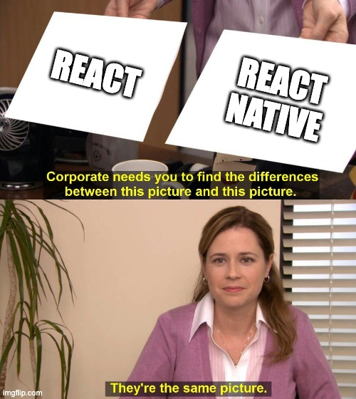
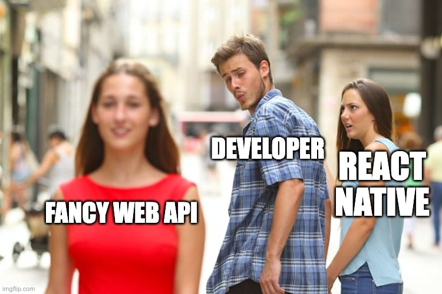

# React vs React Native 0
## Key Differences and Commonalities


---

# Commonalities
## What React Web and React Native Share


---

## JSX Syntax
```jsx
// Both use the same JSX syntax
const Welcome = ({ name }) => {
  return <Text>Hello, {name}!</Text>
}

// Conditional rendering
{isLoggedIn ? <Dashboard /> : <Login />}

// Lists
{users.map(user => <UserCard key={user.id} user={user} />)}
```

---

## React Hooks
```jsx
// useState - same in both
const [count, setCount] = useState(0)

// useEffect - same lifecycle
useEffect(() => {
  fetchData()
}, [dependency])

// Custom hooks work identically
const { data, loading } = useApi('/users')
```

---

## JavaScript Runtime
```jsx
// Same JavaScript features
const processData = async (data) => {
  const filtered = data.filter(item => item.active)
  const sorted = filtered.sort((a, b) => a.name.localeCompare(b.name))
  return sorted
}

// Same async/await patterns
const fetchUser = async (id) => {
  const response = await api.get(`/users/${id}`)
  return response.data
}
```

---

## File-based Routing - Next.js
```jsx
// Next.js - app directory
app/
├── page.js           // → /
├── about/
│   └── page.js       // → /about
├── blog/
│   ├── page.js       // → /blog
│   └── [slug]/
│       └── page.js   // → /blog/:slug
└── api/
    └── users/
        └── route.js  // → /api/users
```

---

## File-based Routing - Expo Router
```jsx
// Expo Router - app directory
app/
├── index.js          // → /
├── about.js          // → /about
├── blog/
│   ├── index.js      // → /blog
│   └── [slug].js     // → /blog/:slug
└── _layout.js        // Root layout
```

---

## Styling Philosophy
```jsx
// Similar approach - component-scoped styles
const styles = StyleSheet.create({
  container: {
    flex: 1,
    padding: 20,
    backgroundColor: '#fff'
  },
  title: {
    fontSize: 24,
    fontWeight: 'bold'
  }
})

// CSS-in-JS also works in both
const StyledButton = styled.button`
  background: blue;
  color: white;
`
```

---

# Key Differences
## Where React Web and React Native Diverge



---

## JS Runtime Environment - React Web
```jsx
// React Web - DOM available
document.getElementById('root')
window.location.href
localStorage.setItem('key', 'value')

// Browser APIs available
navigator.userAgent
window.addEventListener('resize', handler)
```

---

## JS Runtime Environment - React Native
```jsx
// React Native - No DOM
import { AsyncStorage } from '@react-native-async-storage/async-storage'
import { Linking } from 'react-native'

// No window, document, or browser APIs
// Use native modules instead
```

---

## HTML Elements - React Web
```jsx
// React Web - HTML elements
<div className="container">
  <h1>Title</h1>
  <p>Paragraph text</p>
  <button onClick={handleClick}>Click me</button>
  <input type="text" value={value} onChange={onChange} />
  
  <a href="/link">Link</a>
</div>
```

---

## Native Components - React Native
```jsx
// React Native - Native components
<View style={styles.container}>
  <Text style={styles.title}>Title</Text>
  <Text>Paragraph text</Text>
  <TouchableOpacity onPress={handlePress}>
    <Text>Click me</Text>
  </TouchableOpacity>
  <TextInput value={value} onChangeText={onChangeText} />
  <Image source={{uri: 'https://...'}} />
  <TouchableOpacity onPress={() => Linking.openURL('https://...')}>
    <Text>Link</Text>
  </TouchableOpacity>
</View>
```

---

## Navigation - React Router (Web)
```jsx
// React Web - React Router
import { BrowserRouter, Routes, Route } from 'react-router-dom'

<BrowserRouter>
  <Routes>
    <Route path="/" element={<Home />} />
    <Route path="/profile" element={<Profile />} />
    <Route path="/blog/:slug" element={<BlogPost />} />
  </Routes>
</BrowserRouter>

// URL-based navigation
navigate('/profile')
```

---

## Navigation - React Navigation (Native)
```jsx
// React Native - React Navigation
import { NavigationContainer } from '@react-navigation/native'
import { createStackNavigator } from '@react-navigation/stack'

const Stack = createStackNavigator()
<NavigationContainer>
  <Stack.Navigator>
    <Stack.Screen name="Home" component={Home} />
    <Stack.Screen name="Profile" component={Profile} />
  </Stack.Navigator>
</NavigationContainer>

// Screen-based navigation
navigation.navigate('Profile')
```

---

## User Interactions - React Web
```jsx
// React Web - Mouse & Keyboard
<div 
  onClick={handleClick}
  onMouseOver={handleHover}
  onMouseLeave={handleLeave}
  onKeyDown={handleKeyPress}
  onFocus={handleFocus}
>
  Interactive element
</div>

// Hover states, focus management
```

---

## User Interactions - React Native
```jsx
// React Native - Touch & Gestures
<TouchableOpacity onPress={handlePress}>
  <Text>Press me</Text>
</TouchableOpacity>

<PanGestureHandler onGestureEvent={handlePan}>
  <Animated.View>
    <Text>Drag me</Text>
  </Animated.View>
</PanGestureHandler>

// Touch feedback, haptics
```

---

## Styling - React Web
```css
/* React Web - Full CSS support */
.container {
  display: flex;
  flex-direction: row;
  justify-content: center;
  align-items: center;
  margin: 10px;
  padding: 20px;
  border: 1px solid #ccc;
  border-radius: 8px;
  box-shadow: 0 2px 4px rgba(0,0,0,0.1);
  background: linear-gradient(45deg, #f0f0f0, #fff);
  position: absolute;
  z-index: 10;
}

/* CSS Modules, Styled Components, etc. */
```

---

## Styling - React Native
```jsx
// React Native - Limited CSS subset
const nativeStyles = StyleSheet.create({
  container: {
    flexDirection: 'row',
    justifyContent: 'center',
    alignItems: 'center',
    margin: 10,        // No units
    padding: 20,       // No units
    borderWidth: 1,    // Different property names
    borderColor: '#ccc',
    borderRadius: 8,
    // No boxShadow - use elevation on Android
    elevation: 2,
    // No gradients - use LinearGradient component
    position: 'absolute'
  }
})
```

---

## Platform-Specific Code - React Web
```jsx
// React Web - Browser detection
const isChrome = /Chrome/.test(navigator.userAgent)
const isSafari = /Safari/.test(navigator.userAgent)

// Browser-specific features
if ('serviceWorker' in navigator) {
  navigator.serviceWorker.register('/sw.js')
}

// CSS browser prefixes handled by build tools
```

---

## Platform-Specific Code - React Native
```jsx
// React Native - Platform detection
import { Platform } from 'react-native'

const styles = StyleSheet.create({
  container: {
    paddingTop: Platform.OS === 'ios' ? 20 : 25,
    ...Platform.select({
      ios: { shadowColor: '#000' },
      android: { elevation: 5 }
    })
  }
})

// Platform-specific components
const Button = Platform.OS === 'ios' ? TouchableOpacity : TouchableNativeFeedback
```

---

## Development Tools - React Web

- Browser DevTools (Elements, Console, Network)
- React DevTools extension
- Hot reload in browser
- Network tab for API debugging
- Lighthouse for performance
- Webpack/Vite dev server

---

## Development Tools - React Native

- Chrome Dev Tools / Rozenite
- Proxyman (or any proxy tool)
- Device/Simulator testing
- Fast Refresh
- Xcode for iOS
- Android Studio for Android

---

## Development Tools - React Native

<iframe src="https://link.excalidraw.com/readonly/Iu3u5LjJ3OffkXZEhBAy?darkMode=true" width="100%" height="100%" style="border: none;"></iframe>

---

## Build & Deployment - Web

<iframe src="https://link.excalidraw.com/readonly/IJz3bL7qQjQIaG2vtPMS?darkMode=true" width="800" height="100%" style="border: none;"></iframe>


---

## Build & Deployment - Mobile

<iframe src="https://link.excalidraw.com/readonly/Wjl2GcYgUDM8XHwode0p?darkMode=true" width="800" height="100%" style="border: none;"></iframe>

---

## Summary - Commonalities
### What React Web and React Native Share
- ✅ JSX syntax
- ✅ React hooks
- ✅ JavaScript runtime
- ✅ Component architecture
- ✅ File-based routing
- ✅ Styling philosophy
- ✅ State management patterns

---

## Summary - Key Differences
### Where React Web and React Native Diverge
- 🔄 JS runtime (DOM vs Native)
- 🔄 Navigation systems
- 🔄 User interactions
- 🔄 Styling capabilities
- 🔄 Platform-specific features
- 🔄 Development tools
- 🔄 Build processes

--- 

# The saga continues...

## Next time
- Brief history of hybrid development
- Setup a project
- Creating a page and styling it
- Key components: View, Text, Pressable, Scrollview, Flatlist
- Navigation: stack & tabs

---

# Homework
- Visit: [get started with Expo](https://docs.expo.dev/get-started/introduction/)
- Follow the steps:
    - _Create a project_
    - _Setup your environment_
    - _Start developing_


